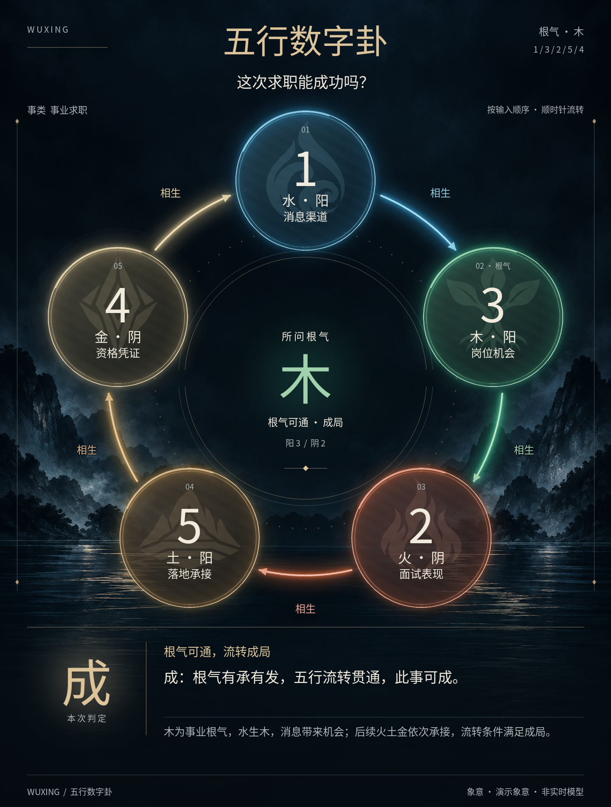

# wuxing_num（五行数字卦图）

AstrBot 专用的五行数字卦插件。它把五个数字按河图数字五行映射为：

- 1、6 为水
- 2、7 为火
- 3、8 为木
- 4、9 为金
- 5、0 为土

数字阴阳按奇偶划分：`1、3、5、7、9` 为阳，`0、2、4、6、8` 为阴。排盘会逐位显示阴阳，并统计阴阳数量和纯阴、纯阳或阴阳偏盛状态。

插件只注册 `/数字卦` 和专用 Agent 工具 `divine_wuxing_five_numbers`，没有全局消息监听，不会接管六爻、铜钱、摇卦、爻辞或纳甲请求。每次有效起卦都会生成一张 `1440 × 1900` PNG 卦图。

## 卦图设计

- 正式标题为「五行数字卦」，采用深墨底、金色标题、环形气路与中央根气的东方幻想风布局。
- 使用独立无字山水底图呈现山体、薄雾与湖面倒影；背景素材和最终生成提示词见 [底图说明](assets/backgrounds/README.md)。底图缺失时回退到本地绘制背景。
- 圆弧采用抗锯齿亮芯、近光和宽幅柔光三层叠加，节点使用带细微材质的玻璃底和双层发光边缘。光晕先模糊遮罩再着色，避免颜色与透明度同时模糊导致压暗。
- 参考用户提供的元素标志风格，重新生成五行专属徽记：水纹、火焰、枝叶根系、金属刃面、层叠山岩。
- 五个宫位顺时针排列，箭头和标签显示相生、同气、耗气、逆生或受克。
- 元素徽记去掉白底，以约 13% 不透明度作为属性背后的大幅水印；数字、五行与象意位于水印上层，保持不透明。
- 五个数字以圆形节点呈现，根气节点标注「根气」，中央汇总根气、阴阳数量及规则状态；底部独立显示本次判定。
- 关系沿圆弧顺时针连接，采用实线/虚线和完整关系文字双重编码；受克弧另加阻断刻线。仅真实流通的边使用柔光，不添加不存在的关系。
- 死卦中央使用断续装饰环和明确原因，不把「根气不现」画成「根气受克」；成败死卦均使用计算内核的原结论。
- 长问题、逐位象意和总象按区域自动换行及缩小字号，过长文字显示省略号；断语拥有固定独立区域。
- 图片写入问题、根气、事类、逐位象意、总象、流转关系和固定断语。

其中数字、阴阳、五行关系和成败由本地计算内核确定；事类、五位象意及总象由当前 Agent/会话模型分析，LLM 不得修改插件算出的结论。

| 数字 | 五行 | 专属徽记 |
| --- | --- | --- |
| 1、6 | 水 | 青蓝水滴与卷浪 |
| 2、7 | 火 | 朱红烈焰与镂空焰心 |
| 3、8 | 木 | 翠绿枝叶与根系 |
| 4、9 | 金 | 金色菱形金属刃面 |
| 5、0 | 土 | 赭黄山峰与层叠岩土 |

借鉴参考图的纯色、尖端曲线与镂空设计语言，徽记专为水火木金土重新生成。金直接表现为金属，不用雷代替。相生相克仍按原五行算法计算，不采用游戏元素反应；LLM 提示与工具说明包含这条边界。

徽记图集保存在 `assets/icons/wuxing_emblems.png`，随插件发布；不依赖临时附件路径或外网。缺少或损坏时使用无水印的五行节点，数字、属性和判定仍正常显示。来源、图集布局和生成提示词见 [素材说明](assets/icons/README.md)。Pillow 将随包背景与程序绘制的节点、光效、流转关系和文本确定性合成，不需要每次调用图片生成模型。

使用 `python tools/preview.py`（在插件目录执行）重新生成下方示例；其中象意为演示数据。

使用 `python -B tools/preview.py --all` 生成成、败、根气不现、根气被截和长文本五种预览；也可用 `--case failure --output-dir <目录>` 单独输出。预览只调用真实计算内核和渲染器，不调用 LLM、不发送群消息、不修改死卦次数。此次视觉调整不修改判卦规则或三次死卦处理逻辑。



## 用法

```text
/数字卦 这次求职能否成功 | 1 3 2 5 4
/数字卦 合同能否顺利签下 | 13254 | 金
```

命令的第三段根气可省略；省略时按问题关键词稳定归类。命令模式会调用当前会话模型生成象意，超时或模型不可用时会明确标记为“本地规则回退”。

Agent 调用工具时必须先根据问题明确选择一个根气元素，并提供：

- `matter_type`：明确的事物类型，例如事业求职、财务交易、感情婚姻。
- `five_symbolic_meanings`：严格按五个数字原顺序写五条象意，以 `｜` 分隔。
- `symbolic_summary`：结合问题、根气和流转写出的明确总象，不得修改成败结论。

用户没有提供数字时，Agent 可以自行给出五个数字，但必须在答复中公开这五个数字。

每次只会给出三种明确结果之一：

- `成`：根气可流通，流转分不低于 3，至少三段同气/相生，且至多一段受克阻断。
- `败`：卦可立，但流转条件不足，明确判为不成。
- `死卦`：根气不现，或根气两侧均不通；要求为同一问题重新给五个数字。

同一用户对同一问题连续三次得到死卦后，插件会明确告知“此事天机不可泄露”，并劝其更换问题或停止继续询问。记录保存在 `data/plugin_data/wuxing_num/dead_streaks.json`。

## 流转计分

五行按五个位置首尾成环计算：同气 `+1`、顺生 `+2`、逆生泄气 `-1`、我克耗气 `0`、受克阻断 `-2`。最终输出包含数字、阴阳序列、五行链、根气、每段关系、逐位象意、总象、判定和一句确定断语。

## 测试

```powershell
python -m pytest astrbot_plugin_wuxing_num/tests -q
```
